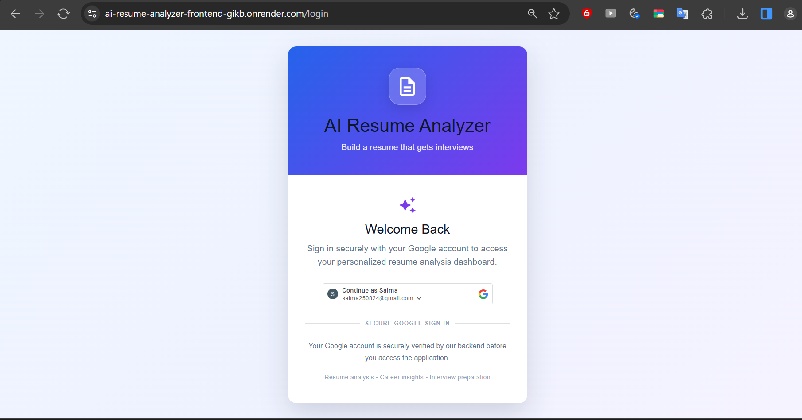
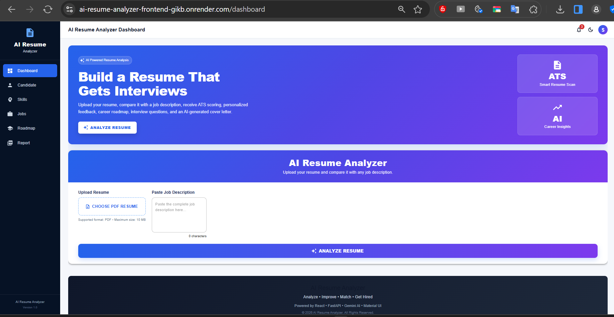
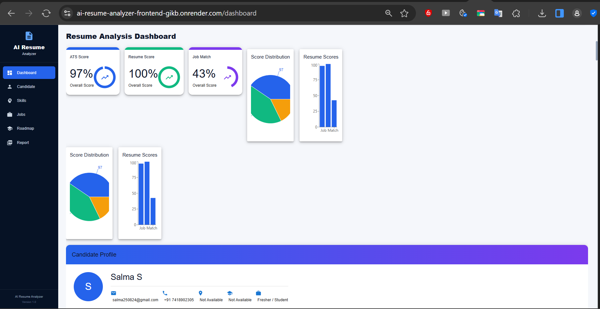
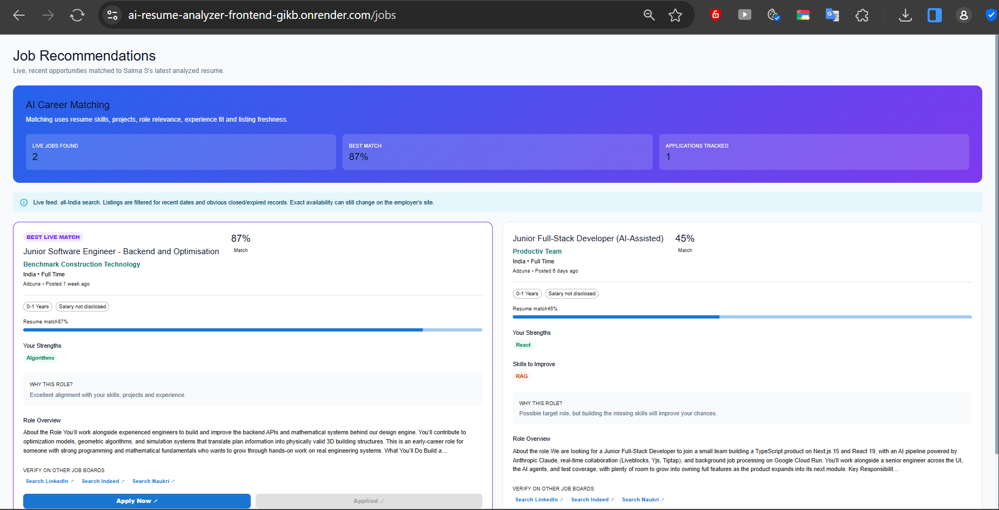
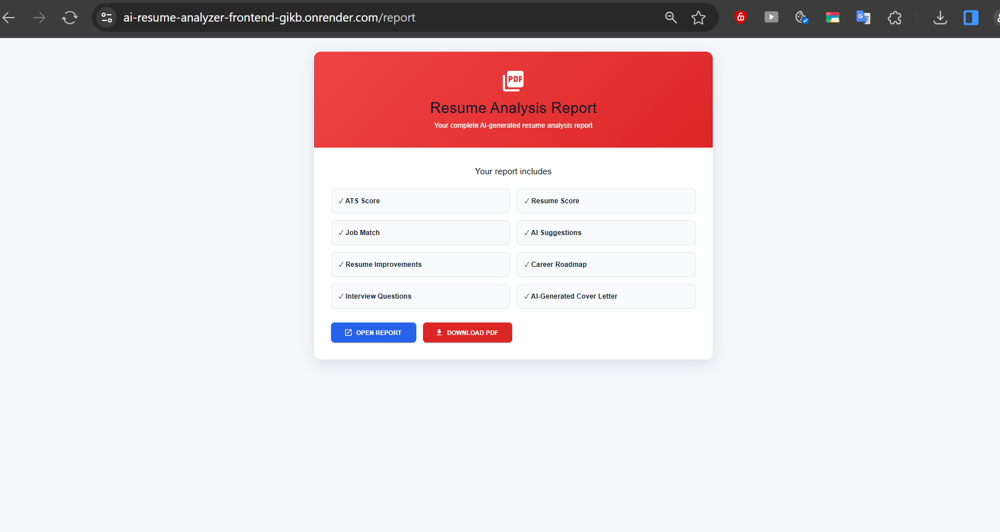

# 🤖 AI Resume Analyzer

AI-powered resume analysis and job recommendation platform that helps job seekers analyze their resumes, compare them with job descriptions, identify skill gaps, and prepare for interviews.

## 🌐 Live Demo

🔗 [AI Resume Analyzer](https://ai-resume-analyzer-frontend-gikb.onrender.com/)

---

## ✨ Features

- 📄 Upload PDF resumes
- 🎯 ATS score analysis
- 📊 Resume score analysis
- 💼 Job match score
- 🧠 AI-powered resume suggestions
- 🔍 Skill gap identification
- 💼 AI-powered job recommendations
- 🗺️ Personalized career roadmap
- 🎤 AI-generated interview questions
- ✉️ AI-generated cover letter
- 📑 Resume analysis report
- 📥 Downloadable PDF report
- 🔐 Google authentication
- 📈 Interactive dashboard and charts

---

## 📸 Screenshots

### 🔐 Login



### 📊 Dashboard



### 📄 Resume Analysis



### 💼 Job Recommendations



### 📑 Resume Analysis Report



---

## 🛠️ Tech Stack

### Frontend

- React
- JavaScript
- Axios
- Material UI
- Chart.js
- HTML
- CSS

### Backend

- Python
- FastAPI
- REST API

### AI

- Generative AI
- AI-powered resume analysis
- Job matching
- AI recommendations
- Interview preparation
- Cover letter generation

### Authentication

- Google Authentication
- JWT Authentication

### Deployment

- GitHub
- Render
- Docker

---

## 🔮 Future Improvements

- LinkedIn profile analysis
- Resume builder
- Multiple resume versions
- Job application tracking
- Advanced ATS keyword analysis
- More job-board integrations
- Personalized learning recommendations
- Skill-gap learning resources
- Resume comparison
- Advanced career analytics

---

## 👩‍💻 Author

### Salma S

**Computer Science Engineering | AI & Machine Learning**

GitHub:

🔗 [github.com/salma2516](https://github.com/salma2516)

---

## ⭐ Project Highlights

This project demonstrates practical experience with:

- React
- JavaScript
- Python
- FastAPI
- REST APIs
- AI/ML integration
- Generative AI
- Resume analysis
- Job matching
- Skill gap analysis
- Authentication
- Data visualization
- PDF report generation
- Docker
- Cloud deployment
- Git & GitHub

---

## 📄 License

This project is developed for educational, portfolio, and demonstration purposes.

## 🔄 How It Works

1. User signs in using Google authentication.
2. User uploads their PDF resume.
3. User enters a target job description.
4. The frontend sends the resume and job description to the FastAPI backend.
5. The backend processes the uploaded resume.
6. AI analyzes the resume against the job requirements.
7. The system generates:
   - ATS score
   - Resume score
   - Job match score
   - Missing skills
   - Resume improvement suggestions
   - Interview questions
   - Career roadmap
   - AI-generated cover letter
8. Results are displayed on the interactive dashboard.
9. Relevant job recommendations are provided.
10. Users can generate and download the resume analysis report as a PDF.

---

## 🏗️ Project Structure

```text
AI-Resume-Analyzer/
│
├── backend/
│   ├── app/
│   │   ├── api/
│   │   ├── core/
│   │   ├── database/
│   │   ├── models/
│   │   ├── reports/
│   │   ├── schemas/
│   │   ├── services/
│   │   ├── uploads/
│   │   ├── utils/
│   │   ├── application_router.py
│   │   └── main.py
│   │
│   └── requirements.txt
│
├── frontend/
│   ├── src/
│   ├── public/
│   ├── package.json
│   └── ...
│
├── screenshot/
│   ├── dashboard.png
│   ├── job_recommendation.png
│   ├── login.png
│   ├── report.png
│   └── resume_analysis.png
│
├── docker/
│
├── .env.example
├── .gitignore
├── docker-compose.yml
└── README.md
